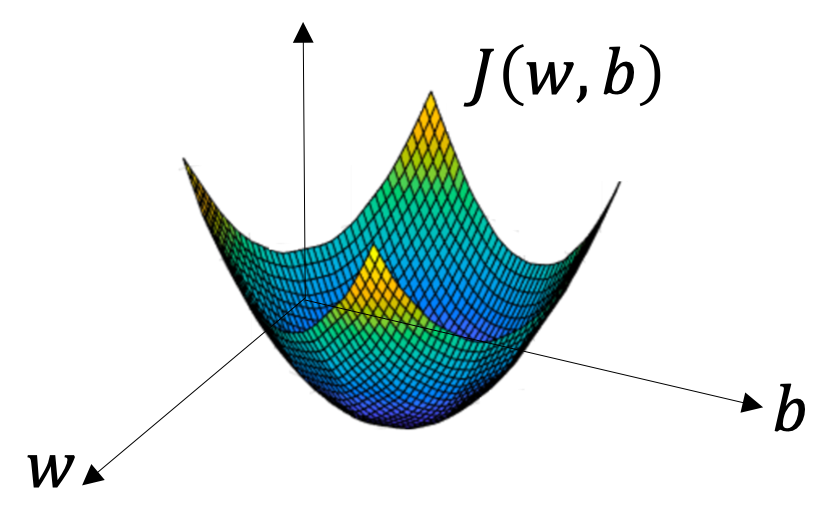

## Notation

For a binary classification problem

* $(x, y)$, a training sample where $x \in \mathbb{R}^{n_x}$ and $y \in \{0, 1\}$
* $\{(x^{(1)}, y^{(1)}), \cdots, (x^{(m)}, y^{(m)})\}$, $m$ training samples
* $m$, number of training samples (also denoted as $m_{\text{train}}$). In contrast, $m_{\text{test}}$ is the number of test samples.
* $X = \begin{bmatrix}
   | & & | \\
   x^{(1)} & \cdots & x^{(m)} \\
   | &  & | \\
 \end{bmatrix}$ with shape $(n_x, m)$, training data. Note that by convention in this course, each column is a training sample.
* $Y = \begin{bmatrix}
y^{(1)} & \cdots & y^{(m)} \\
\end{bmatrix}$ with shape $(1, m)$, training labels. Note that by convention in this course, each column is a training label.

****
## Logistic Regression
Given $x\in \mathbb{R}^{n_x}$, the probability $P(y=1 | x)$ is modeled as

$$\hat{y} = \sigma(w^\top x + b)$$

where $w\in \mathbb{R}^{n_x}$, $b\in\mathbb{R}$, and sigmoid function $\sigma(z) = \frac{1}{1 + e^{-z}}$.

  

**Loss function**

$$L(\hat{y}, y) = - [y\log \hat{y} + (1-y)\log(1-\hat{y})]$$

**Cost function**

$$J(w, b) = \frac{1}{m}\sum_{i=1}^m L(\hat{y}^{(i)}, y^{(i)})$$

**QA**: Why not $L = -\frac{1}{2}(\hat{y} - y)^2$?

It turns out this loss function is non-convex which would be hard to find the global optima.

**QA**: Loss VS. Cost?

Loss function is defined for single training sample, while cost is defined for a batch of training samples.

**Note**: In this series of courses, weight and bias are treated as seperated for easier implementation and illustration. Hence $\theta = [b, w^\top]^\top$ is **not** used here.

****
## Gradient Descent
Gradient of a point gives the direction with largest "uphill slope". By walking in the opposite direction, we go downhill on the cost surface as much greedy as we can.

  

